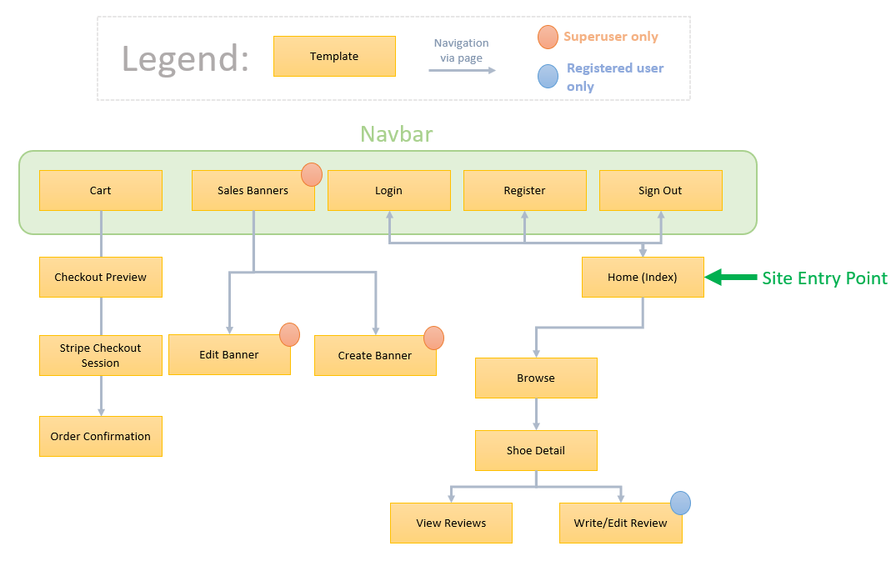

# **[Shoop](https://ms4-shoop.herokuapp.com/)**
 

Shoop is a fictional online eCommerce website for shoes where users can buy and review a variety of different shoe types

This project was completed for my **Code Institute Milestone 4 Project**. The site is built using **HTML, CSS, Bootstrap & Javascript** for the front end and **Python, Django, PostgreSQL and AWS S3** for the back end. It is deployed on **Heroku** at the following location: **https://ms4-shoop.herokuapp.com/**

**Note:** I was unable to complete this project in time for the given deadline. Therefore this README is incomplete, sections with further work needed are marked with the phrase: *( -- SECTION INCOMPLETE --)*

## **UX**
The **five planes of user experience design** developed by Jesse James Garrett was used as the conceptual framework for the development process of this site

---

### **Strategy Plane**

The overall objective of Shoop is to be a easy-to-use eCommerce website that offers a wide variety of trendy designer shoes for site viewers. A unique feature of Shoop that sets it apart from other shoe sellers is its review functionality. Users can write reviews and give ratings on shoes that they have bought. Review data is visible on the site for all viewers to see and allows them to make educated decisions on purchases. The site owners also occasionally will run flash sales to encourage users to buy. They therefore require these sales to be visible to the viewers on the site's landing page. With these objectives in mind, a list of user stories was created to facilitate the development of the site. 

### **User Stories**

#### Site Owners
1. As a site viewer, I want to browse products in the store
2. As a site viewer, I want to view specific products in the store
3. As a site viewer, I want to search for specific items by text
4. As a site viewer, I want to search for specific items by category
5. As a site viewer, I want to sort items in the store
6. As a site viewer, I want to add products to a cart in the store
7. As a site viewer, I want to purchase products in the cart
8. As a site viewer, I want to review items in the store
9. As a site viewer, I want to see other peoples reviews and what the overall score for an item is

#### Site Viewers
1. As I site owner, I want to edit specific products in the store
2. As I site owner, I want to add new products to the store
3. As I site owner, I want to update current products in the store
4. As I site owner, I want to delete current products in the store
5. As I site owner, I want to add sale banners to the store
6. As I site owner, I want to delete sale banners to the store
7. As I site owner, I want to update sale banners to the store

---

### **Scope Plane**
To plan out the scope of the site, a list of minimum viable product features were compiled to help with development. A second list of *"nice-to-have"* features were compiled that if feasible, would be targetted in order to improve the overall experience of the site.

**Group 1: Minimum Viable Product Features**  

<!-- **Group 2: Nice to Have Features** -->
---

### **Structure Plane**
*( -- SECTION INCOMPLETE --)*

#### **Database Schema** 
<!-- diagram   -->

#### **Site Plan** 
A visual plan of the site is shown below. This details all templates/pages in the site and the various paths users can take to navigate through the site

 

There are 15 total pages throughout the site. The name and function of each one is details below: 

* **Home/Index**  
Homepage of the site. Gives a call to action to user to go to browse the collections of shoes available to purchase on the site

* **Browse**  
Allows user to view all shoes for sale on the site. User can also perform search queries here to find specific shoes according to their needs

* **Shoe Detail**  
Individual shoe profile. Gives details on the shoe type, description etc. The user can choose to add the shoe to their cart here or view and write reviews for the shoe.

* **View Reviews**  
Displays all reviews submitted for a particular shoe on the site.

* **Write/Edit Review**  
Allows the user to write or edit a review for a particular shoe on the site. Only accessible for logged in users. 

* **Login & Register & Sign out**  
Standard user authentication pages for creating and logging into an account on the site. Functionality is provided by allauth app for django. Templates are custom styled to match the aesthetic of the site.

* **Cart**  
Shows the current items in the shopping cart for the users' session

* **Checkout Preview**  
Before the user pays for the items in their cart, they are directed to this screen where they can see an order summary and give their address details

* **Stripe Checkout Session**  
Stripe hosted page for payed for items in cart

* **Order Confirmation**  
After payment has been submitted, user is directed to this page which ca=ontains order confirmations details if payment has been successful

* **Sales Banners**  
Allows superusers to maintain sales banners displayed on the homepage of the site. Superuser can choose to creat, edit or delete sales banners from this page

* **Create Banner**  
Allows superusers to create a sales banner on the site

* **Edit Banner**  
Allows superusers to edit sales banner currently displayed on the site

---

### **Skeleton Plane**
*( -- SECTION INCOMPLETE --)*

---

### **Surface Plane**
*( -- SECTION INCOMPLETE --)*

**Color Palette**

**Font**  

---

### **Features** 
*( -- SECTION INCOMPLETE --)*

#### **Existing Features**

#### **Features Left to Implement**

---

### **Technologies Used**
* [Visual Studio Code](https://code.visualstudio.com/)  
Code editor I used to write my code
* [HTML](https://en.wikipedia.org/wiki/HTML5)  
For markup
* [CSS](https://en.wikipedia.org/wiki/CSS)  
For styling the site
* [Bootstrap](https://getbootstrap.com/)  
Framework used to create and style components on the front end
* [jQuery](https://jquery.com/)  
For programming certain dynamic elements in the front end of the site
* [Python](https://www.python.org/)  
For programming the back end of the site
* [Django](https://www.djangoproject.com/)  
Used as a web framework for the site
* [Heroku Postgres](https://devcenter.heroku.com/articles/heroku-postgresql)  
The database for the site
* [Heroku](https://id.heroku.com/login)  
Platform where the site is deployed
* [Font Awesome](https://fontawesome.com/)  
Used for icons throughout the site
* [Git](https://git-scm.com/)  
For version control
* [GitHub](https://github.com/)  
For storing my files and for hosting the site on Github Pages
* [favicon-generator.org](https://www.favicon-generator.org/)  
Used to generate a favicon for the site
* [Balsamiq](https://balsamiq.com/)  
Used to create wireframes
* [dbdiagram](https://dbdiagram.io/home)  
Used to create the database schema diagram for this readme
* [Amazon S3](https://aws.amazon.com/s3/?did=ft_card&trk=ft_card)  
Used for cloud storage of site media files

---

### **Testing**
*( -- SECTION INCOMPLETE --)*
Please see [TESTING.md](TESTING.md) for details on the testing carried out for this project

---

### **Initial Project Setup**
* To begin the project, I first created a working directory on my computer called **MS4**
* In this working directory, I created a python virtual environment called .venv buy using the following command in a VSCode terminal:
   * `python -m venv .venv`
* I created a bash script called `venv.sh` which activated this virtual environment whenever needed using the terminal command `source venv.sh`
* I then installed django and created a django project using the following commands:
   * `pip install django`
   * `django-admin startproject shoop`
* Whenever I needed to run a development server I made sure my virtual environment was activated (using `source venv.sh` if neccessary) and then ran the `./manage.py runserver` command to start the server
* The individual components of the site are stored in seperate django **apps**. Whenever I need to make a new app for the site I ran the command `./manage.py startapp *APPNAME*`

### **Version Control**

* To start using version control, I created a local repository using Git:
   *  I opened my working directory on my computer (called **MS4**)
   *  I opened the directory using VS code and started a terminal
   *  I initialized the directory as a Git repository using the command `git init`
   *  When I was ready to commit my first set of changes, I used the `git add .` and the `git commit -m "Initial commit"` commands in my terminal
   
* During the inital project setup I created a **.gitignore** file to make sure certain files werent tracked by version control. The files inclued in this **.gitignore** included **.venv** (my local development virtual environment), **__pycache__/** and **env.py** (my local development environment variables)

* Any time I had installed new dependencies for the project using pip, I used the command `pip freeze > requirements.txt` to store the installed packages from my venv in a **requirements.txt** file

* In order to store my commits remotely on Github
   * I created a remote repository on Github by selecting the **New Repository** button and following the on screen steps
   * I linked my local repository on my computer to the remote repository. To do this, in my VS code terminal, I used the command `git remote add origin https://github.com/steharr/ms4-shoop` and `git remote -v`

* Throughout the development process, I would regularly push my commits to Github using the `git push` command 

#### **Database Version Control**
* Django uses an ORM system to allow developers to interact with their database without need to write complex SQL queries. In order to set up and make changes to database tables used by this system I used the following steps:
   * I created (or adjusted) a django model in the **models.py** file in the directory of the app I was working on
   * I used the command `./manage.py makemigrations --dry-run` to validate the changes made
   * I then ran the command without the `--dry-run` flag to create the migrations for the database
   * I then ran the command `./manage.py migrate` to apply the migrations once they had been made

* To populate the database with initial objects to be used in the site, I provided django with data using **fixtures**
   * I created a folder called *fixtures* in the app that the fixtures belonged to
   * In this folder, I created **.json** files with initial data
   * Whenever I needed to load this data into the database I used the command `./manage.py loaddata *JSON FILENAME*`
---

### **Deployment**

This website is deployed on [Heroku](https://id.heroku.com/login). The static files and media files for the site are stored on an [Amazon S3](https://aws.amazon.com/s3/?did=ft_card&trk=ft_card) cloud storage bucket. The steps taken to deploy the site are detailed below:

#### **Creating a DB**
1. I created a new app on my heroku profile called **ms4-shoop**
1. I provisioned a **Postgres** database for the website in the resouces section of the heroku database
1. To wire up my project to this database, I carried out the following steps:
   * I installed **dj_database_url** and **psycopg2-binary** using pip
   * I added these dependencies to my **requirements.txt** file using the `pip freeze > requirements.txt` command
   * In my projects django **settings.py** file I added a new database configuration by adjusting the **DATABASES** constant (shown below). The **DATABASE_URL** is available in the config variables of the Heroku app dashboard.

       
   * I then ran django migrations to set up all models of my app in the new postgres database. Commands: `./manage.py makemigrations` and `./manage.py migrate`
   * I loaded my fixtures in the new database by using the `./manage.py loaddata *JSON FILENAME*` for each fixture.
   * I created a superuser for the new database using the `./manage.py create superuser` command

#### **Deploying to Heroku**
1. I ran the command `pip install gunicorn` to install the gunicorn package which acts as the webserver for the site. (Alse freezed this into the requirements file)

1. I also created a `Procfile` which contained the instruction: `web: gunicorn shoop.wsgi:application` to insturct heroku to create a web dyno to serve the app.

1. I logged into my heroku profile from a terminal in VScode. I initialized a heroku git remote for my local project using the following command `heroku git:remote -a ms4-shoop`

1. I then temporarily disabled the heroku collectstatic in shoop heroku app to prepare for the deployment *(As the static files were going to be stored on the S3 bucket to be setup in later steps)*. This was achieved using the command `heroku config:set DISABLE_COLLECTSTAIC=1` 

1. I added the domain of the shoop heroku app to the list of **ALLOWED_APPS** in my projects **settings.py** file.

       
1. I also adjusted the **settings.py** file so that development related configurations werent going to be deplyed into production. These are shown below:
   * Ensuring debug was only switched on in my development environment
   * Ensuring that a django SECRET_KEY was not deployed into the productive environment

       
1. I then pushed the project to heroku using the command `git push heroku main`. Heroku then proceeded to build my app

      * **Note:** *At this point I could have set up automatic deploys to heroku everytime I pushed my changes to github, however I decided against doing this and instead only pushing to heroku whenever the project was stable after completing each new feature*

#### **Setting up S3 Bucket**
*( -- SECTION INCOMPLETE --)*

1. 

---

### **Credits**
*( -- SECTION INCOMPLETE --)*

#### **Code**
#### **Images**

### **Acknowledgments**
* My mentor, **Spencer Barriball** who guided me through this project.
* Fellow **Code Institute** students on Slack who helped troubleshoot issues and give me inspiration for this project 