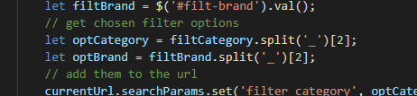
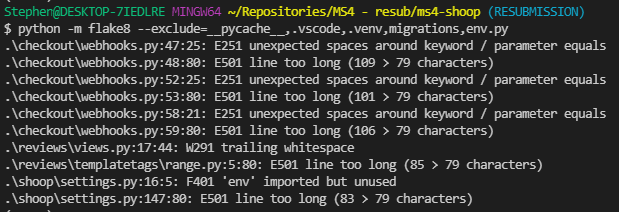

## **Testing**
*( -- SECTION INCOMPLETE --)*

### **Notable Bugs Occurring During Development**

#### **New Balance brand search query not working**

**Description**
Whenever the user chose to filter a search for shoes with the 'New Balance' brand, they would receive an error message. The search queries were designed to be able to work even when they is no shoes available matching the query i.e. it should work even if there were no New Balance shoes in the database. Running it with Debug=True in my local development environment produced the below message:

 

**Root Cause**
When a search query is made, a js script runs to add search parameters to the url so that they can be extracted from the request in the back end. The script seperates the search query parameter from the search type by splitting the values in the form by underscores (shown below)

 

The New Balance brand was stored in the database with a programmatic name of `new_balance`. The underscore in the name was causing the script to make a query with the filter incorrectly set to equal `new`.

**Fix**  
In order to fix this, I adjusted the *New Balance* brand in the database to have a programmatic name of `new-balance`. For new brands being added to the database, a convention of not including underscores would need to be used in order to avoid this problem occurring again.

### **HTML Validation**
In order to validate the quality of my HTML Code, I passed it through the [W3C HTML Validator](https://validator.w3.org/) for all pages of my site to ensure there were no major issues. As there is Django templating logic throughout the html pages, source code was taken from the rendered pages and passed into the validator (Rather than passing it as a URI).

**Landing Page**  

Warnings:
* *The type attribute is unnecessary for JavaScript resources.*  
Fixed by removing

* *The first occurrence of ID shoop-title was here.*  
The shoop-title id was only needed for style purposes so fixed by changing the offending id into a class

* *The first occurrence of ID button-addon2 was here.*  
Was being used by aria attribute purposes so changed the ids so that they were unique in each instance, i.e. button-addon1 and button-addon2

Errors
* *Duplicate ID*   
Fixed after addressing related warnings

* *Element div not allowed as child of element ul in this context. (Suppressing further errors from this subtree.)*  
Fixed by reorganising the structure of the navbar dropdown menu on smaller screens

* *Duplicate attribute class.*  
Typo error fixed by removing the duplicate

**Browse Page**  

Warnings:
* *The type attribute is unnecessary for JavaScript resources.*  
Fixed by removing

**Product Detail Page**  

No errors or warnings

**View Reviews Page**  

No errors or warnings

**Login Page**  

No errors or warnings

**Write Review Page**  

Errors
* *Duplicate attribute class.*  
Typo error fixed by removing the duplicate

**Sales Banners Maintenance Page**  

Errors
* *Element h5 not allowed as child of element button in this context. (Suppressing further errors from this subtree.)*  
Changed to span

* *Element p not allowed as child of element button in this context. (Suppressing further errors from this subtree.)*  
Removed from button

**Create Sales Banners Page**  

No errors or warnings

**Edit Sales Banners Page**  

No errors or warnings

**Cart Page**  

Warnings:
* *The type attribute is unnecessary for JavaScript resources.*  
Fixed by removing

**Checkout Page**  

No errors or warnings

### **CSS Validation**
In order to validate the quality of my CSS Code, I passed it through the [W3C CSS Validator](https://jigsaw.w3.org/css-validator/). Results below:

### **Javascript Validation**
In order to validate the quality of my JavaScript Code, I passed it through the [Jshint linter](https://jshint.com/). Results below:

### **Python Validation**
In order to validate the quality of my Python Code, I used the [Flake8 tool](https://flake8.pycqa.org/en/latest/#quickstart).
After installing the tool using pip, I ran the below command in a terminal to get all linting errors associated with the python code of my project 

`python -m flake8 --exclude=__pycache__,.vscode,.venv,migrations,env.py`  

**Note:** I add the --exclude flag to exclude all files containing code not written by me e.g. packages in my virtual environment directory (.venv) or migrations

An overview of the results recieved is displayed in the table below.
| Problem | Count | Comment |
| ----------- | ----------- | ----------- |
| W292 no newline at end of file                              | 8 |   |
| F401 Package imported but never used                        | 24 |   |
| E501 line too long                                          | 10 |   |
| E251 unexpected spaces around keyword / parameter equals    | 3 |   |
| W291 trailing whitespace                                    | 8 |   |
| F811 redefinition of unused 'category' from line 1          | 1 |   |
| F541 f-string is missing placeholders                       | 1 |   |
| E722 do not use bare 'except'                               | 1 |   |
| F841 local variable 'e' is assigned to but never used       | 2 |   |

The majority of these cases were corrected except for ten shown below:

 

### **Peformance Tests**
### **User Stories Tests**
### **Remaining Unfixed Bugs**